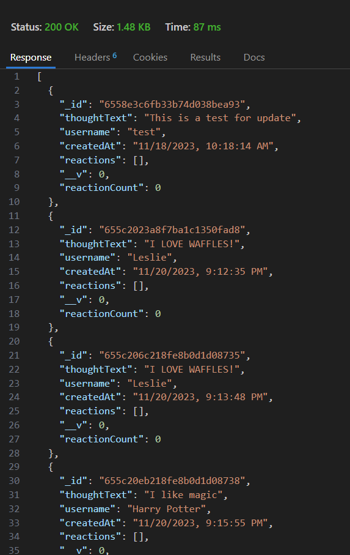

# SociallyCallApi
## Description

To build an API for a social network web application where users can share their thoughts, react to friends’ thoughts, and create a friend list. Using Express.js for routing, a MongoDB database, and the Mongoose ODM. In addition to using the [Express.js] and [Mongoose] packages as well using a the native JavaScript `Date` object to format timestamps.


## User Story

```
AS A social media startup
I WANT an API for my social network that uses a NoSQL database
SO THAT my website can handle large amounts of unstructured data
```

## Table of Contents

- [SociallyCallApi](#sociallycallapi)
  - [Description](#description)
  - [User Story](#user-story)
  - [Table of Contents](#table-of-contents)
  - [Usage](#usage)
  - [Technologies Used](#technologies-used)
  - [References](#references)
  - [Links](#links)
    - [GitHub Repository](#github-repository)
    - [Walkthrough Video](#walkthrough-video)
  - [License](#license)


## Usage





## Technologies Used

- Express js
- Mongoose
- MongoDb
- JavaScript

## References

- UT Austin Bootcamp Curriculum: Module 18 
- Express.JS v.4.17.1: https://expressjs.com/en/starter/installing.html
- Mongoose v.8.0.0: https://mongoosejs.com/ 
- MongoDB: https://www.mongodb.com/products/tools/compass

## Links

### <a href="https://github.com/KaiDoll/sociallycallapi">GitHub Repository</a>

### <a href="https://drive.google.com/file/d/1lNu-sKDigtD2dQZ0Q3XPo7F4zEeURl1M/view?usp=sharing">Walkthrough Video</a>


## License


Copyright 2023 - SociallyCallApi

Permission is hereby granted, free of charge, to any person obtaining a copy of this software and associated documentation files (the “Software”), to deal in the Software without restriction, including without limitation the rights to use, copy, modify, merge, publish, distribute, sublicense, and/or sell copies of the Software, and to permit persons to whom the Software is furnished to do so, subject to the following conditions:

The above copyright notice and this permission notice shall be included in all copies or substantial portions of the Software.

THE SOFTWARE IS PROVIDED “AS IS”, WITHOUT WARRANTY OF ANY KIND, EXPRESS OR IMPLIED, INCLUDING BUT NOT LIMITED TO THE WARRANTIES OF MERCHANTABILITY, FITNESS FOR A PARTICULAR PURPOSE AND NONINFRINGEMENT. IN NO EVENT SHALL THE AUTHORS OR COPYRIGHT HOLDERS BE LIABLE FOR ANY CLAIM, DAMAGES OR OTHER LIABILITY, WHETHER IN AN ACTION OF CONTRACT, TORT OR OTHERWISE, ARISING FROM, OUT OF OR IN CONNECTION WITH THE SOFTWARE OR THE USE OR OTHER DEALINGS IN THE SOFTWARE.
